#  Cloud-Based File Storage System using Azure Blob Storage & Storage Explorer

This project demonstrates building a **cloud-based file storage system** using **Azure Blob Storage**, allowing users to **upload, view, and manage files** both online and through **Azure Storage Explorer**.

---

##  Project Overview

This solution enables:

- Uploading files to Azure Blob Storage  
- Viewing stored files from the cloud  
- Managing blobs using Azure Portal  
- Accessing and controlling storage with Azure Storage Explorer  

It showcases **real-world cloud storage administration** for beginners in Azure.

---

##  1. Create Azure Storage Account

- Created a new **Resource Group**: `resourcegroup`
- Created a **Storage Account**:
  - **Name:** `mystoragespace24`
  - **Redundancy:** LRS (Locally Redundant Storage)
  - **Other settings:** Default options
- Completed deployment using **Review + Create**

---

##  2. Configure Azure Blob Storage

- Navigated to the deployed storage account
- Opened **Storage Browser → Blob Container**
- Created a new container: `newcontainer`
- Uploaded files using **Upload option**
- Enabled access:
  - Opened **Configuration**
  - Allowed **Anonymous Access**
  - Changed **Access Level** in container panel

---

##  3. Connect to Azure Storage Explorer

- Opened **Azure Storage Explorer**
- Selected **Add Connection**
- Chose **Storage Account or Service → Connection String**
- Retrieved connection string from Azure:
  - Portal → `mystoragespace24`
  - **Security + Networking → Access Keys**
  - Copied the **Connection String**
- Pasted the connection string in Storage Explorer to link the account
- Successfully accessed and managed container and blobs using the Explorer

---

## Project screenshots
-1 Create Azure Storage Account
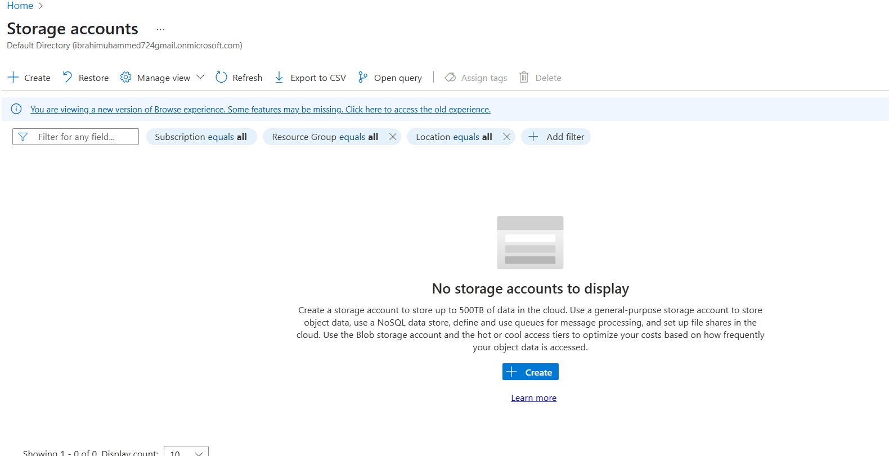

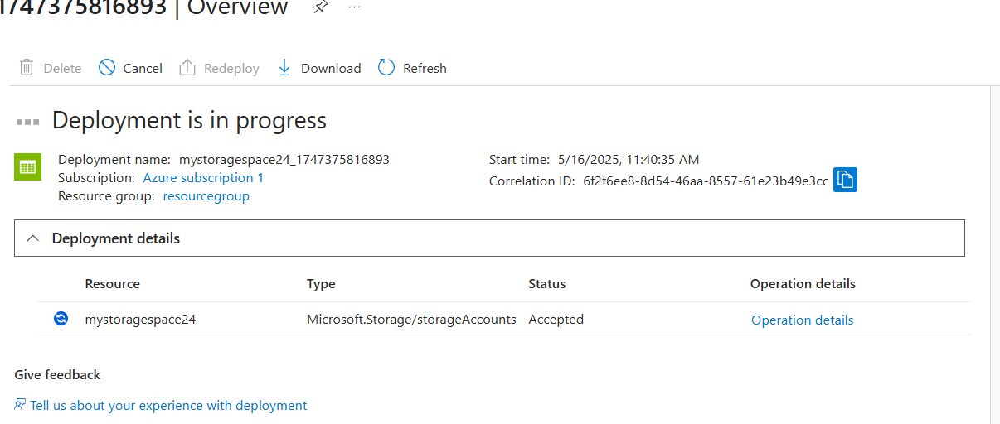
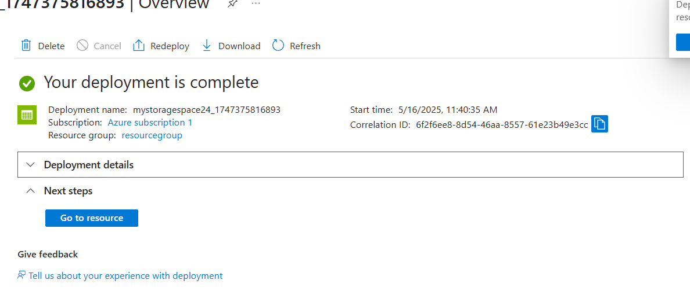

-2 Configure Azure Blob Storage
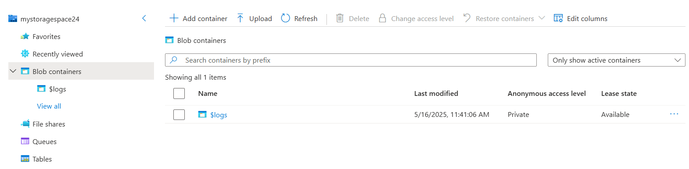
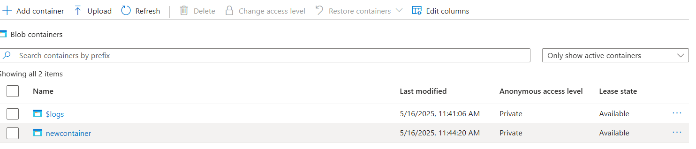
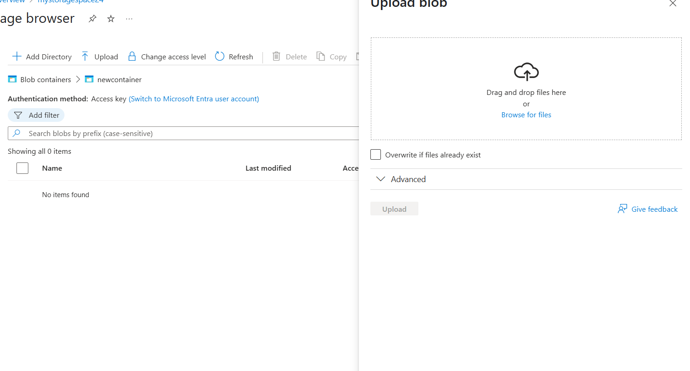
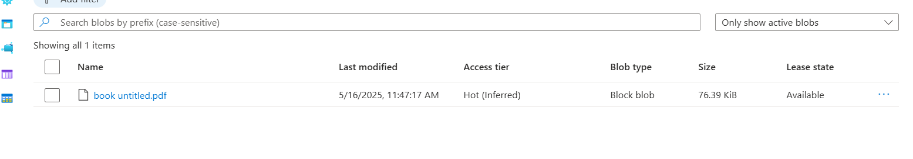
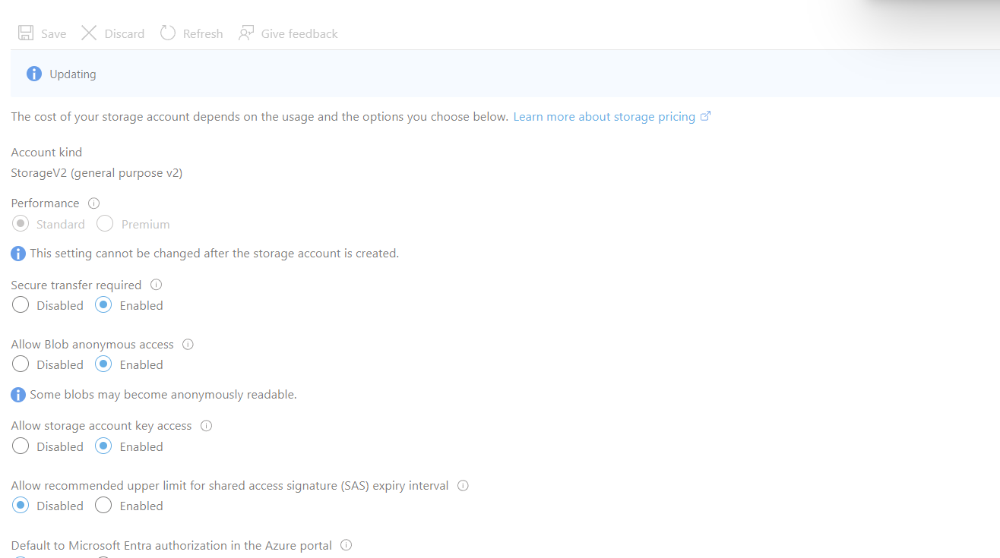
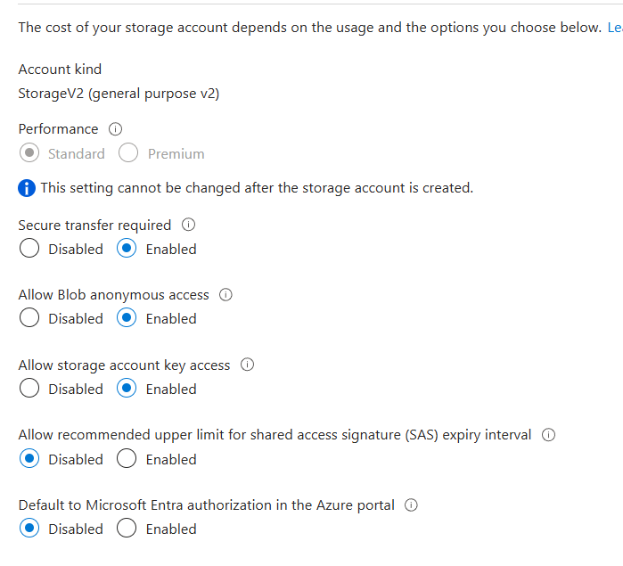

-3 Connect to Azure Storage Explorer
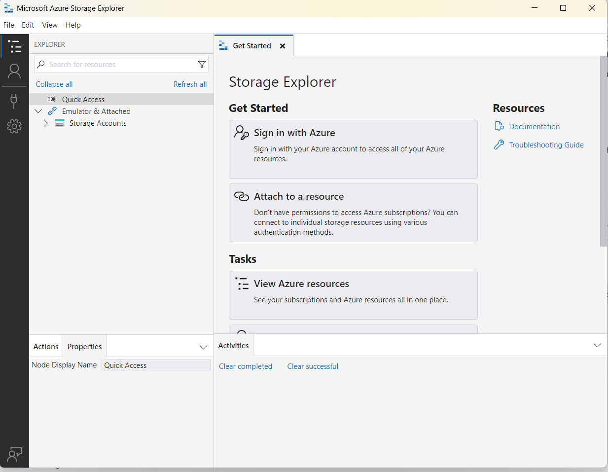
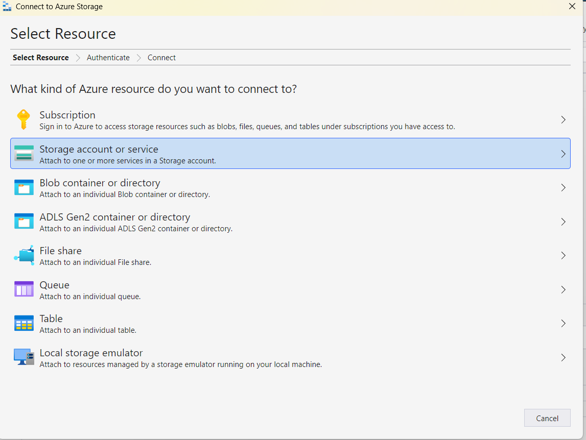
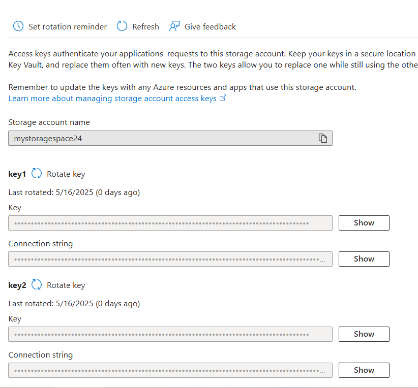
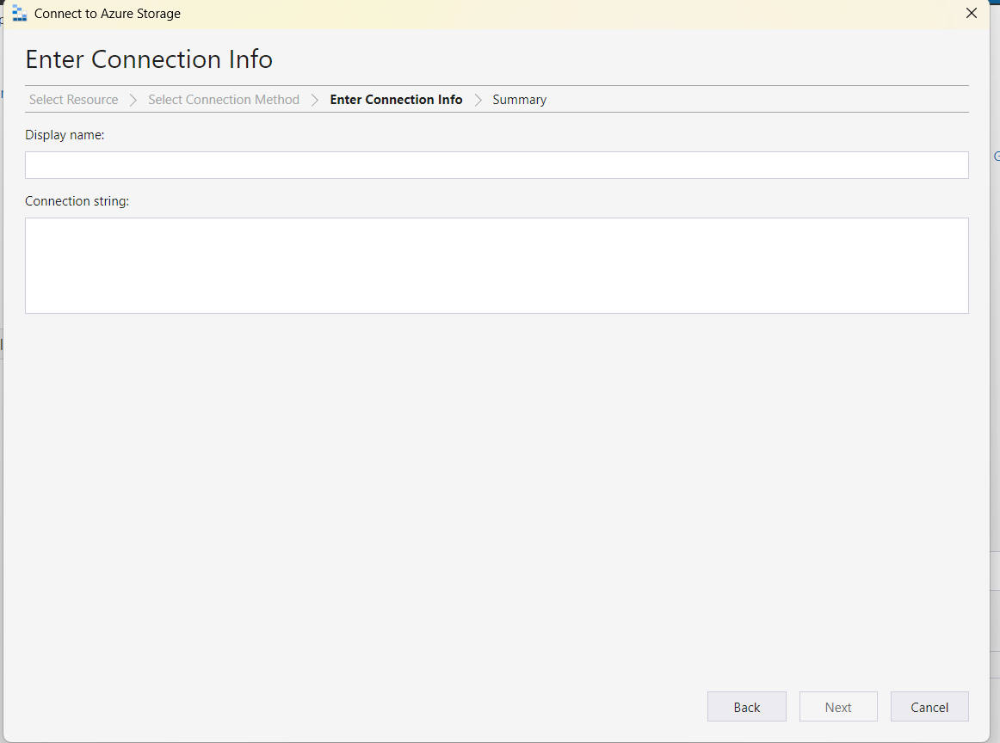
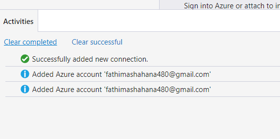
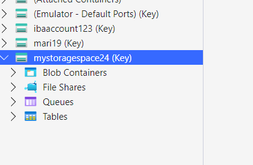
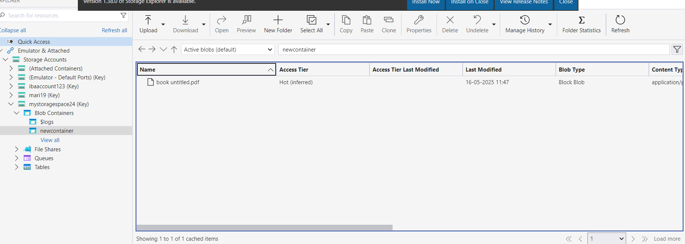

---

## Skills Gained

- Azure Storage Account Management  
- Working with **Azure Blob Storage**  
- Configuring **Access & Security Policies**  
- Using **Azure Storage Explorer** for file management  
- Understanding cloud file hosting concepts  

---

## Project Type

Beginner-level hands-on deployment demonstrating **cloud storage setup** and **real-world data management** on Azure.

---

##  Status

 Completed — Cloud File Storage System Successfully Implemented
